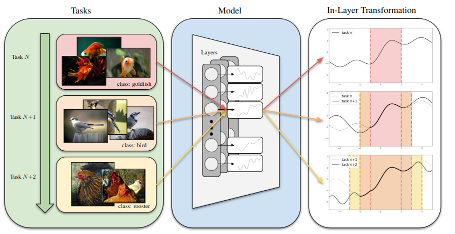

# InTAct: Interval-based Task Activation Consolidation for Continual Learning

**Authors**: Patryk Krukowski, Jan Miksa, Piotr Helm, Jacek Tabor, Paweł Wawrzyński, Przemysław Spurek  
🎓 *GMUM — Jagiellonian University*



## What is InTAct?

**InTAct** tackles a core challenge in continual learning: **representation drift**. Even with strong prompt-based methods, shared network parameters often shift under domain changes, causing the model to forget previously learned knowledge. InTAct preserves the *functional behavior* of shared layers by capturing activation ranges from past tasks and constraining updates to stay consistent within these regions, without freezing parameters or storing old data.

## Why use InTAct?

InTAct is architecture-agnostic and integrates seamlessly into existing continual learning frameworks. By stabilizing important representations while allowing flexible adaptation elsewhere, it strikes an effective balance between stability and plasticity. Across domain-incremental benchmarks like **DomainNet** and **ImageNet-R**, InTAct consistently reduces representation drift and boosts performance, improving Average Accuracy by **up to 8 percantage points** over state-of-the-art baselines.

---

## Table of Contents

- [Method Overview](#method-overview)
- [Getting Started](#getting-started)
  - [Setup](#setup)
  - [Launching Experiments](#launching-experiments)
  - [Running Sweeps](#running-sweeps)
- [Acknowledgements](#acknowledgements)
- [License](#license)
- [Citation](#citation)
- [Contact](#contact)

---

## <a name="method-overview"></a> Method Overview

**InTAct** enables continual learning by selectively stabilizing the network's functional behavior in regions that matter, **activation hypercubes ($\mathcal{H}$)**, while allowing plasticity elsewhere.

### The Core Concept: Interval-Based Preservation
Instead of freezing parameters or relying on data replay, InTAct summarizes the activation distribution of past tasks into **hypercubes**. These hypercubes capture the central $p%$ of neuron activations for a given layer.

During training, we treat these hypercubes as critical functional manifolds. We use **interval arithmetic (IA)** to mathematically guarantee that the network's output remains stable whenever an input falls within these protected regions.

### The Objective Function

InTAct employs a composite loss function to balance stability, plasticity, and representational efficiency:

$$\mathcal{L}_{\text{Total}} = \mathcal{L}_{\text{Task}} + \mathcal{L}_{\text{IntDrift}} + \mathcal{L}_{\text{Var}} + \mathcal{L}_{\text{Align}} + \mathcal{L}_{\text{Feat}}$$

### Loss Components Breakdown

| Component | Name | Purpose |
| :--- | :--- | :--- |
| **$\mathcal{L}_{\text{IntDrift}}$** | **Internal Representation Drift** | **The Core Engine.** Uses **IA** to enforce that $\Delta W \cdot \mathcal{H} + \Delta b \approx 0$. It guarantees that for any input within the protected hypercube, the layer's transformation remains invariant. Applies to all layers where input hypercubes are defined. |
| **$\mathcal{L}_{\text{Var}}$** | **Activation Compactness** | Minimizes the variance of activations for the current task. This forces new knowledge into tighter clusters, preventing "hypercube explosion" and preserving network capacity for future tasks. |
| **$\mathcal{L}_{\text{Align}}$** | **Inter-Task Alignment** | Encourages the centers of new task hypercubes ($c_{l,t}$) to align with previous ones ($c_{l,t-1}$). This prevents the cumulative hypercube from expanding over empty "dead space" between disjoint tasks. Uses **adaptive scaling** based on the previous radius: tighter old clusters enforce stricter alignment. |
| **$\mathcal{L}_{\text{Feat}}$** | **Feature Distillation** | **Stabilizes Early Layers.** Since early layers (processing raw data) lack input hypercubes, $\mathcal{L}_{\text{IntDrift}}$ cannot apply. We use a **masked, normalized distillation loss** here to stabilize features relevant to past tasks while allowing new features to emerge. |

---

## <a name="getting-started"></a> Getting Started

### <a name="setup"></a> Setup

1. **Clone the repository**  
   ```bash
   git clone https://github.com/pkrukowski1/InTAct
   cd InTAct

2. **Create and activate the conda environment**
   ```bash
    conda create -n "intact" python=3.9
    conda activate intact
   ```

3. **Install remaining Python packages**
   ```bash
   pip install -r requirements.txt
   ```

4. Configure environment variables
   ```bash
   cp example.env .env
   # Edit `.env` to configure WANDB, dataset paths, etc.
   ```

### <a name="launching-experiments"></a> Launching Experiments

To launch a default experiment with Hydra:
   ```bash
   WANDB_MODE=offline HYDRA_FULL_ERROR=1 python src/main.py --config-name=config
   ```
   > Use WANDB_MODE=online to enable live logging to Weights & Biases

Predefined scripts for grid search, Bayesian search, and other experiment setups are available in the `scripts` folder. You can launch these predefined experiments for specific datasets and continual learning scenarios, for example:
   ```bash
   ./scripts/dil/cifar10/intact/intact.sh
   ```

---

## <a name="acknowledgments"></a> Acknowledgments

- Project structure adapted from [Bartłomiej Sobieski’s template](https://github.com/sobieskibj/templates/tree/master)

---

## <a name="license"></a> Lincense

This project is licensed under the MIT License. See [LICENSE](./LICENSE) for more information.

---

## <a name="contact"></a> Contact
Questions, suggestions or issues?  
Open an issue or contact the authors directly via [GMUM](https://gmum.net/).